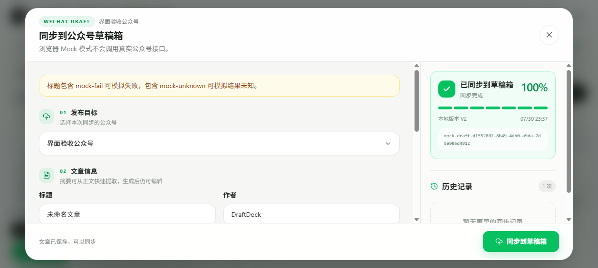

# DraftDock

本地优先的微信公众号写作、排版与草稿同步工作台。

DraftDock 把 Markdown 写作、图片自托管、公众号排版和草稿同步放进一个桌面应用。文章和发布记录保存在自己的电脑，图片上传到自己的 Cloudflare R2，公众号密钥只由 Electron 主进程处理。

```text
写作与整理
→ 图片保存并上传自己的 R2
→ 选择公众号主题与封面
→ 核对标题、摘要和评论设置
→ 同步到公众号草稿箱
→ 在公众号后台做最终预览和发布
```

> DraftDock 只创建草稿，不会自动群发，也不会绕过用户确认。



## 为什么做 DraftDock

公众号作者经常在飞书、Notion、Word、AI 对话和 Markdown 编辑器之间来回搬运内容。正文可以复制，图片、排版、封面和发布记录却仍要重复处理。

DraftDock 解决的是这条最后一公里：

- 原稿始终留在本地，可直接读取和备份。
- 图片进入自己的对象存储，不依赖第三方图床。
- 同一份 Markdown 可以切换主题、预览并复制到公众号。
- 配置公众号后，可以直接创建草稿并查看实时进度。
- 同步失败不会影响本地文章，结果不确定时也不会盲目重试。

## 已实现能力

### 写作与排版

- Markdown 实时编辑与预览
- 飞书、Notion、Word 和网页富文本转 Markdown
- 30 套公众号排版主题
- 手机、平板和桌面预览
- 编辑区与预览区双向滚动同步
- 点击预览内容定位 Markdown
- 微信兼容 HTML 转换
- 富文本复制、HTML 导出和 PDF 导出

### 本地文章工作区

- Electron 桌面应用
- 默认工作目录 `Documents/DraftDockWorkspace`
- 自定义工作目录
- 新建、打开、删除和自动保存文章
- 800ms 防抖保存与文章版本记录
- `article.md + metadata.json + assets/` 透明文件结构
- Windows NSIS 安装包和 Portable 便携版
- 浏览器 localStorage Mock 模式，便于开发和自动化测试

### 图片资产管线

- 剪贴板粘贴、拖拽和文件选择
- PNG、JPEG、WebP 优化，GIF 原样保留
- SHA-256 内容寻址和远程去重
- Cloudflare R2 上传、连接测试与失败重试
- 三并发上传队列和中断恢复
- `assets/manifest.json` 状态记录
- 上传成功后自动替换 Markdown 图片 URL
- 未完成图片拦截复制、导出和草稿同步
- Electron `safeStorage` 加密 R2 密钥

### 微信公众号草稿同步

- 多公众号配置、连接测试和默认作者
- AppSecret 使用 Electron `safeStorage` 加密
- 从正文生成可编辑摘要，自动清理标题、代码和图片标记
- 从正文图片中选择封面
- 评论与仅粉丝评论设置
- 自定义发布核验卡，不调用系统原生确认框
- 正文图片上传为公众号可用 URL
- 封面上传为永久素材并获取 `media_id`
- 七阶段实时同步进度、图片上传数量和完成提示
- 本地版本、远程草稿 ID、错误步骤和历史记录
- 草稿过期提醒
- `unknown` 状态人工确认，避免重复创建草稿
- 保留“复制到公众号”作为兜底方式

## 草稿同步流程

1. 在“公众号”设置中填写名称、AppID 和 AppSecret。
2. 测试连接并保存配置。
3. 完成文章写作，等待正文图片上传成功。
4. 点击“同步草稿”，确认标题、作者、摘要、封面和评论设置。
5. 在核验卡中检查目标公众号、版本和图片数量。
6. 确认后在右侧查看实时同步进度。
7. 成功后到公众号后台完成最终预览和发布。

同步过程依次执行：

```text
校验文章
→ 生成公众号 HTML
→ 上传正文图片
→ 上传封面素材
→ 创建公众号草稿
→ 保存同步记录
→ 完成
```

本地 `article.md` 始终保留原始 R2 URL。公众号专用图片 URL 和草稿 ID 只写入发布快照与同步记录。

## 数据目录

```text
DraftDockWorkspace/
├── articles/
│   └── <article-id>/
│       ├── article.md
│       ├── metadata.json
│       ├── assets/
│       │   ├── manifest.json
│       │   ├── originals/
│       │   └── processed/
│       └── publishes/
│           ├── index.json
│           └── <publish-id>/
│               ├── input.json
│               ├── source.html
│               ├── wechat.html
│               ├── image-map.json
│               └── result.json
└── exports/
```

这些文件都是普通文本和图片，可以独立备份，不依赖 DraftDock 官方云端服务。

## 安全边界

- Renderer 不启用 Node.js，通过 Preload 白名单 IPC 调用桌面能力。
- IPC 校验调用方窗口与 frame，外部页面不能调用特权接口。
- R2 Secret 和公众号 AppSecret 仅由 Electron 主进程解密。
- Access Token 只缓存在内存，不写入文章、快照或日志。
- 远程图片仅接受 HTTPS，并阻止私网、保留地址、DNS 重绑定和危险重定向。
- 下载限制图片类型、字节数和超时时间。
- 发布 HTML 使用标签与属性白名单清理危险内容。
- 浏览器模式只保存 Mock 元数据，不保存真实 AppSecret，也不调用微信接口。
- 同步失败、图片失败或记录写入失败都不能破坏本地 Markdown。

## 快速开始

### 环境要求

- Node.js 20+
- pnpm 9+
- Windows 桌面模式需要 Electron 支持的系统环境

### 安装

```bash
git clone https://github.com/xbhog/draftdock.git
cd draftdock
pnpm install
```

### 浏览器 Mock 模式

```bash
pnpm dev
```

浏览器模式用于界面开发和自动化测试：

- 文章、图片状态和发布记录保存在 localStorage
- 图片使用 Mock R2 URL
- 公众号同步生成 `mock-draft-*` 草稿 ID
- 不读取本机密钥，不请求真实 R2 或微信公众号接口

### Electron 桌面模式

```bash
pnpm dev:desktop
```

桌面模式会读写本地工作区，并可以连接 Cloudflare R2 与微信公众号 API。

## 构建与验证

```bash
pnpm lint
pnpm test
pnpm test:e2e
pnpm build
pnpm build:desktop
```

桌面安装包输出到 `release/`。

## 技术架构

```text
React Renderer
  ├── Markdown 编辑、主题与预览
  ├── 图片状态与发布面板
  └── 浏览器 Mock Provider
          ↓ 白名单 IPC
Electron Preload
          ↓
Electron Main
  ├── ArticleService
  ├── AssetService / Sharp / R2
  ├── CredentialService / safeStorage
  ├── WeChatTokenService / WeChatApiClient
  ├── WeChatPublisher
  └── PublishRecordService
          ↓
本地文件系统 / Cloudflare R2 / 微信公众号 API
```

主要技术：

- React 18、TypeScript、Vite 5、Tailwind CSS 3
- markdown-it、Turndown、highlight.js、Framer Motion
- Electron、electron-builder、Sharp
- AWS SDK for JavaScript v3、Cloudflare R2
- Vitest、Playwright

## 文档导航

- [产品需求](docs/PRD.md)
- [本地文章工作区测试](docs/TESTING.md)
- [R2 图片资产管线设计](docs/PHASE2-R2-ASSET-PIPELINE.md)
- [R2 图片资产管线测试](docs/TESTING-R2.md)
- [微信公众号草稿同步设计](docs/PHASE3-WECHAT-DRAFT-SYNC.md)
- [微信公众号草稿同步测试](docs/TESTING-WECHAT.md)
- [第三方开源声明](THIRD_PARTY_NOTICES.md)

## 当前边界

DraftDock 当前不会：

- 自动群发或定时发布
- 自动登录或操作公众号后台
- 批量发布到多个公众号
- 删除或更新远程草稿
- 把文章和密钥同步到 DraftDock 云端
- 自动生成整篇文章

“从正文生成摘要”是本地确定性文本提取，不会调用外部 AI 服务。后续 AI 发布检查仍处于规划阶段。

## 项目路线

| 阶段 | 状态 | 主要能力 |
|---|---|---|
| 本地文章工作区 | 已完成 | Electron、本地 Markdown、自动保存、版本与桌面打包 |
| R2 图片资产管线 | 已完成 | 图片处理、R2、去重、Manifest 和失败恢复 |
| 公众号草稿同步 | 已完成 | 安全配置、素材上传、草稿创建、进度与历史记录 |
| AI 发布助手 | 规划中 | 标题、摘要、结构和移动端阅读检查 |
| 产品化交付 | 进行中 | Release、自动更新、用户手册和稳定性收尾 |

## 开源来源

DraftDock 基于 [Raphael Publish](https://github.com/liuxiaopai-ai/raphael-publish) 二次开发，复用并改造其 Markdown 渲染、富文本转换、主题系统、微信兼容转换、多端预览、富文本复制和 HTML/PDF 导出能力。

详细归属信息见 [THIRD_PARTY_NOTICES.md](THIRD_PARTY_NOTICES.md)。

## License

本项目使用 [MIT License](LICENSE)。使用、修改和分发时，请保留原项目及 DraftDock 的版权和许可证声明。
